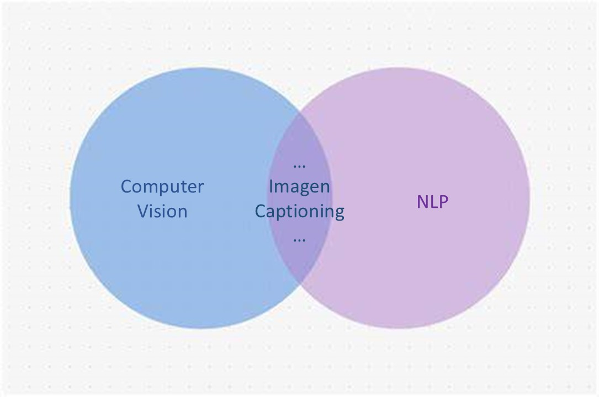
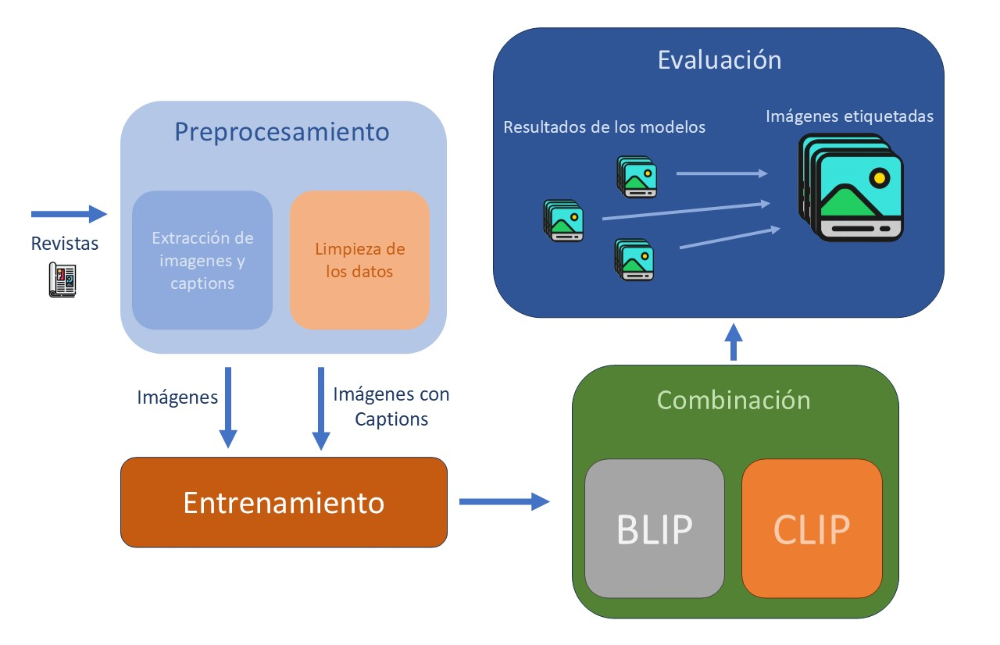
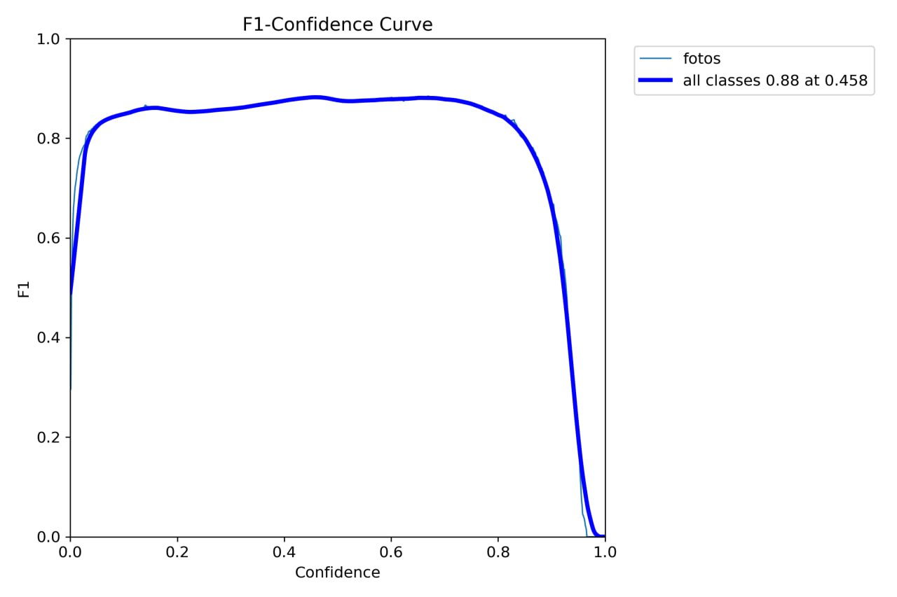
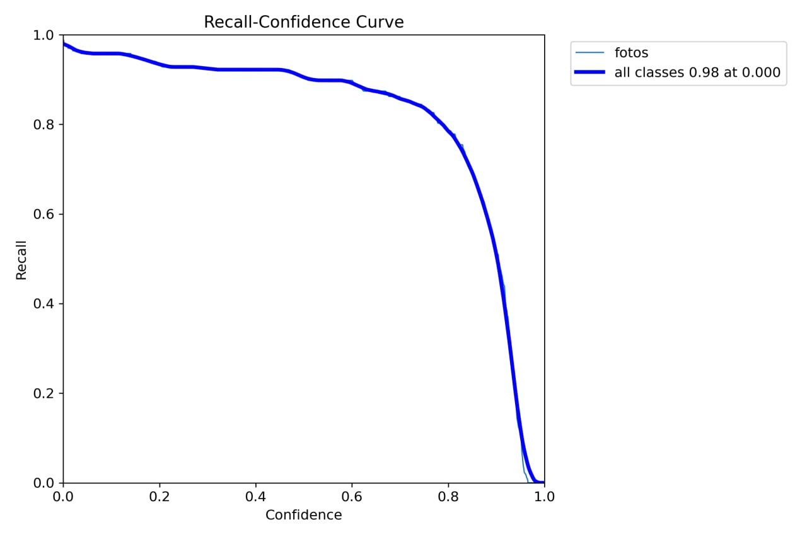
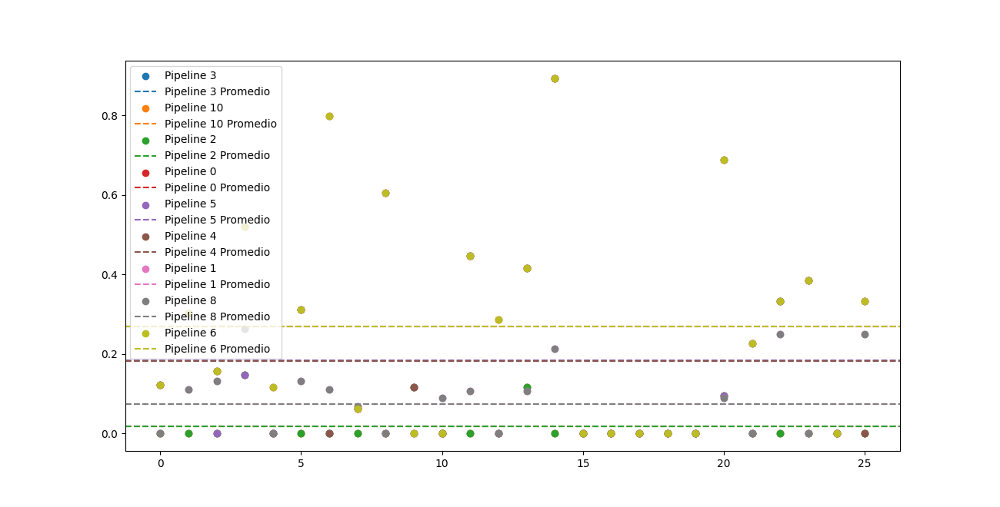

## Introducción

### Contexto y motivación  

Todos los días, nos encontramos con una gran cantidad de imágenes de diversas fuentes como redes sociales, medios digitales, documentación técnica, entre otros, las cuales los espectadores muchas veces tienen que interpretar ellos mismos ya que no tienen una descripción, pero el ser humano puede entenderlas sin necesidad de subtítulos detallados. Sin embargo, con el aumento de los volúmenes de datos ha surgido la necesidad de tenerlos bien descritos para ser almacenados y poder buscarlos de manera eficiente. Dado que la descripción manual de imágenes es un proceso costoso y poco escalable, la automatización de esta tarea se ha vuelto una prioridad en el desarrollo de tecnologías inteligentes.

### Problema a resolver  

La Oficina del Historiador de La Habana dispone de un acervo de más de 200 ejemplares pertenecientes a la Colección de Revistas Social, los cuales contienen un volumen significativo de imágenes que requiere ser almacenadas junto con su respectiva descripción para facilitar su catalogación y recuperación. No obstante, una proporción considerable de estas imágenes carece de descripciones explícitas dentro de las publicaciones. A pesar de ello, es posible inferir información relevante a partir del contexto proporcionado en la revista o mediante el análisis del contenido visual de las imágenes.

### Objetivo del proyecto  

El proyecto busca generar descripciones automáticas para las imágenes de la Colección de Revistas Social de la Oficina del Historiador de La Habana, donde muchas carecen de textos explicativos. Para ello, se emplearán los modelos preentrenados **CLIP** y **BLIP**, que combinan visión por computadora y procesamiento de lenguaje natural para interpretar el contenido visual y generar descripciones precisas.

## Marco Teórico

### Conceptos clave  

*Image captioning* es el proceso de generar descripciones en lenguaje natural para imágenes. Combina técnicas de visión por computadora y procesamiento del lenguaje natural.

En la última década, ha habido avances significativos en esta área, con modelos evolucionando desde enfoques basados en redes neuronales recurrentes (*RNN*) hasta arquitecturas avanzadas de transformers y modelos multimodales. Los primeros enfoques exitosos en *Image Captioning* utilizaron una combinación de redes neuronales convolucionales (*CNN*) para extraer características visuales y redes neuronales recurrentes (*RNN*), como *Long Short-Term Memory* (*LSTM*), para generar texto secuencialmente. Uno de los modelos más influyentes en esta categoría es *Show and Tell* (Vinyals et al., 2015), el cual emplea una *CNN* preentrenada (*Inception-v3*) para obtener representaciones de imágenes y luego usa un *LSTM* para generar descripciones de manera secuencial. Aunque efectivo, este modelo tiene limitaciones al generar descripciones demasiado genéricas o poco precisas debido a la falta de un mecanismo de atención.

Los avances en modelos de lenguaje, como *Transformer* (Vaswani et al., 2017), llevaron a una nueva generación de modelos de *Image Captioning* que reemplazaron las *RNN* con mecanismos de auto-atención más eficientes. Uno de los primeros enfoques en adoptar transformers fue Image Transformer (Parmar et al., 2018), que aplicó self-attention directamente sobre las imágenes en lugar de utilizar *CNNs*. Sin embargo, este modelo tenía problemas de escalabilidad.

En los últimos años, los modelos multimodales han revolucionado el campo del *Image Captioning*, combinando redes neuronales de visión y modelos de lenguaje avanzados para mejorar la calidad de las descripciones.

### Modelos utilizados 

**CLIP** (**Contrastive Language-Image Pretraining**), desarrollado por OpenAI (Radford et al., 2021), es un modelo multimodal que aprende a relacionar imágenes y texto a través de un entrenamiento contrastivo. Su principal ventaja es que permite interpretar imágenes en función de descripciones en lenguaje natural sin necesidad de un entrenamiento supervisado específico para cada tarea.

**CLIP** tiene dos componentes principales:

- Encabezado de Imagen: Un Vision Transformer (ViT) o una CNN (como ResNet) para extraer representaciones visuales.
- Encabezado de Texto: Un modelo de lenguaje tipo Transformer, similar a BERT, para convertir frases en representaciones numéricas.

Ambos módulos transforman imágenes y textos en un espacio de características compartido donde se pueden comparar directamente.

El entrenamiento contrastivo de **CLIP** se basa en la idea de maximizar la similitud entre pares correctos de imágenes y textos mientras minimiza la similitud entre pares incorrectos. Para lograr esto, **CLIP** se entrena con un gran conjunto de datos de imágenes y sus descripciones de internet. Cada imagen y su texto correspondiente se convierten en representaciones numéricas mediante las redes neuronales vistas anteriormente. Luego, el modelo calcula la similitud entre todos los pares en un mismo lote mediante un producto escalar en un espacio de características compartido. Se emplea una función de pérdida contrastiva (*InfoNCE Loss*), la cual aumenta la proximidad entre los vectores de imágenes y textos correctos y aleja los no relacionados. A través de este proceso, **CLIP** aprende una representación multimodal donde imágenes y descripciones semánticamente similares quedan cercanas en el espacio, permitiéndole realizar tareas de clasificación, búsqueda de imágenes y razonamiento visual-lingüístico sin necesidad de reentrenamiento específico (*zero-shot learning*).

A pesar de esto no puede generar captions directamente, sino en combinación con modelos generativos como **BLIP** (**Bootstrapped Language-Image Pretraining**) (Li et al. 2022), que combina *Vision Transformers* (*ViT*) con modelos de lenguaje como *BERT* para generar captions más precisos y ricos en contexto. **BLIP** es capaz de realizar tanto *Image Captioning* como tareas relacionadas, como *Visual Question Answering* (*VQA*) y *Text-Based Image Retrieval*. Gracias a su enfoque de entrenamiento basado en múltiples objetivos, **BLIP** supera a muchos modelos previos en métricas como *BLEU* y *CIDEr*.

Introduce una arquitectura llamada *Multimodal Mixture of Encoder-Decoder (MED)*, que permite un preentrenamiento más flexible en comparación con modelos previos como **CLIP**, combinando tres enfoques: 
- Codificador unimodal para el alineamiento de imágenes y textos
- Codificador basado en imágenes que incorpora atención cruzada para capturar relaciones más detalladas
- Decodificador basado en imágenes que genera texto condicionalmente. 

Esta combinación es lo que permite que BLIP se desempeñe bien en tareas tanto de comprensión como de generación, mientras que **CLIP** no. En términos de entrenamiento, **BLIP** introduce el método *CapFilt (Captioning + Filtering)* para mejorar la calidad de los datos utilizados en el preentrenamiento. A diferencia de **CLIP**, que entrena en grandes cantidades de pares imagen-texto sin filtrar, **BLIP** utiliza un generador de subtítulos (*Captioner*) para crear descripciones sintéticas y un filtro (*Filter*) para eliminar textos ruidosos, asegurando que el modelo aprenda de datos más limpios y relevantes.

### Trabajos relacionados  

**ClipCap** es un modelo que utiliza las codificaciones de **CLIP** como prefijo para las descripciones textuales. Emplea una red de mapeo simple sobre la codificación obtenida y luego ajusta un modelo de lenguaje para generar descripciones coherentes de las imágenes. Este enfoque ha demostrado ser eficiente y logra resultados comparables al estado del arte en conjuntos de datos como *nocaps*. (Mokady, Bites, & Sadeh, 2021)

**Fine-grained Image Captioning with CLIP Reward** propone el uso de **CLIP** como una función de recompensa para mejorar la precisión de las descripciones generadas. Al calcular la similitud multimodal, se guía al modelo de generación para producir descripciones más detalladas y precisas. (Zhan & Wu, 2022)

**BLIP-2** es una versión avanzada de **BLIP** que puede responder preguntas sobre imágenes y generar subtítulos. **BLIP-2** utiliza una estrategia de preentrenamiento eficiente que combina modelos de visión preentrenados y modelos de lenguaje extenso, superando a modelos anteriores en tareas como **VQAv2** y estableciendo un nuevo estado del arte en subtítulos de *zero-shot*. (Li, Lu, & Wu, 2023) 

## Metodología

### Arquitectura

La arquitectura del sistema está compuesta por los siguientes componentes:

- Preprocesamiento de datos
- Entrenamiento
- Combinación
- Evaluación

### Preprocesamiento de datos

Entre los recursos para el proyecto contamos con:
- 239 ejemplares de la Colección de Revistas Social
- Índice analítico de la revista Social, 1916-1938

El problema que abordamos consiste en trabajar con un conjunto de revistas antiguas que han sido previamente escaneadas. Nuestro objetivo es extraer las imágenes contenidas en estas revistas junto con sus descripciones originales, si las tienen. En los casos en que no exista una descripción, el sistema deberá generarla automáticamente.

#### Extracción de imágenes de las revistas

La extracción de imágenes no era viable mediante métodos convencionales, ya que cada página de las revistas escaneadas se almacenaba como una única imagen. Por ello, se requirió un modelo de detección que permitiera identificar y extraer las fotografías de cada página. Tras analizar el estado del arte, seleccionamos **YOLO** por su eficiencia y precisión en la detección de objetos, permitiendo no solo identificar imágenes, sino también sus posibles descripciones. (Redmon et al., 2016)

Para adaptar **YOLO** a la detección de imágenes en las revistas, construimos una base de datos personalizada. Seleccionamos 14 de las 239 revistas, las dividimos por páginas y las subimos a *Roboflow* para el etiquetado manual. Definimos dos clases: imágenes y captions. Dado que los captions no tenían un formato fijo, los etiquetamos junto con la región de la imagen que contenía el texto, permitiendo diferenciarlos del resto del contenido de la revista.

#### Extracción de captions de las revistas y texto relacionado

Tras extraer las imágenes y captions, utilizamos *Tesseract*, una herramienta de *OCR*, para obtener el texto de las imágenes etiquetadas como captions. En general, el desempeño fue bueno, aunque en algunos casos presentó errores en el reconocimiento de caracteres. Al analizar otras opciones más precisas, encontramos que la mayoría eran de pago, por lo que *Tesseract* se convirtió en la mejor alternativa accesible para nuestro proyecto.

Para cada imagen, se guardó no solo el caption asociado en la revista, sino también el texto alrededor. Esto se hizo porque, en los casos donde no había un caption, el texto circundante podría ayudar al modelo a generar un caption apropiado.

#### Limpieza de los datos

Como se mencionó anteriormente, en muchos casos el caption extraído de las imágenes no era coherente o no describía correctamente la imagen. Para entrenar el modelo que generaría los captions faltantes, necesitábamos imágenes con sus captions lo más precisos posibles. Por lo tanto, era necesario realizar una limpieza de los captions que *Tesseract* extraía incorrectamente o que no estaban bien relacionados con sus imágenes asociadas.

Para esto, utilizamos el modelo **CLIP**, proporcionando como entrada tanto la imagen como su caption. Sin embargo, **CLIP** no podía evaluar directamente la calidad del caption. Por eso, generamos 5 captions alternativos utilizando *Lorem Ipsum* para cada imagen y los pasamos por **CLIP**. Si alguno de los captions generados por *Lorem Ipsum* obtenía una mayor probabilidad de estar relacionado con la imagen, asumíamos que el caption original no era válido y lo eliminábamos.

### Implementación del modelo

Para abordar el problema de agregar etiquetas a las fotos de las revistas, nos apoyamos en los modelos preentrenados **CLIP** y **BLIP**, los cuales muestran un buen rendimiento según el estado del arte y son de código abierto.

Sin embargo, debido a las particularidades de nuestro proyecto, decidimos combinarlos y ajustarlos a los datos específicos de este. La combinación se realizó de la siguiente manera:

Para **CLIP**, utilizamos como captions fragmentos del texto alrededor de las imágenes. **BLIP**, por otro lado, solo requiere las imágenes para generar los captions.
En primer lugar, aplicamos los modelos **CLIP** y **BLIP** de la forma estándar: **BLIP** genera un caption para cada imagen, mientras que para **CLIP** seleccionamos el caption con la mayor probabilidad asociada a cada imagen. A continuación, utilizamos algunas imágenes con captions obtenidos manualmente para realizar un proceso de *fine-tuning* de ambos modelos. Con estos modelos ajustados, intentamos nuevamente generar captions para las imágenes.

Además implementamos un enfoque híbrido con dos estrategias diferentes:
- Usamos **BLIP** para generar un caption para la imagen y lo combinamos con los captions del texto alrededor de la imagen. Este conjunto se utiliza como entrada para **CLIP**, y el resultado con la mayor probabilidad es el que se devuelve como la descripción final de la imagen.
- Usamos **BLIP** para generar un caption para la imagen y, luego, aplicamos **CLIP** de la manera descrita previamente solo con el texto circundante de la imagen. Si el mejor resultado obtenido de **CLIP** tiene una probabilidad suficientemente alta, lo usamos como caption. En caso contrario, nos quedamos con el caption generado por **BLIP**.

### Estrategia de entrenamiento y evaluación:

Para ajustar (*fine-tuning*) los modelos utilizados, nos basamos en las imágenes que ya contaban con descripciones en las revistas. Aunque el entrenamiento debería haber incluido una fase de validación, debido a limitaciones de recursos (cómputo y tiempo), decidimos realizar un entrenamiento "puro", sin validación formal. El objetivo de este ajuste era mejorar el rendimiento de los modelos en el resto de las imágenes de las revistas, ya que estas constituían una representación adecuada del conjunto de datos. 

Para evaluar los modelos resultantes y sus combinaciones, utilizamos un conjunto de imágenes diferente al utilizado en el entrenamiento, cuyas descripciones fueron proporcionadas por uno de los miembros del equipo. Cada modelo (producido a partir de combinaciones de hiperparámetros) se evaluó con estas imágenes y los resultados obtenidos se compararon para identificar el mejor.

Para establecer la superioridad de un modelo sobre otro de manera estadísticamente consistente, utilizamos métricas de similitud de texto, como **METEOR**, **BLEU** y **ROUGE**, que son comunes en tareas de generación de lenguaje natural (NLG). A partir de estas métricas, verificamos que se cumplieran simultáneamente las siguientes condiciones:

- Un **p-value < 0.05** tras realizar un **t-test** sobre los valores de las métricas obtenidos para cada caption generado. Esto asegura que la diferencia entre medias sea estadísticamente significativa.
- El intervalo de confianza calculado a partir de las diferencias de scores no debe incluir el cero.
- El *tamaño del efecto* (*effect size*), basado en **Cohen's d**, debe ser superior a 0.2, lo que verifica la significancia práctica de la diferencia.

Si las tres condiciones se cumplen simultáneamente, podemos concluir con alta probabilidad que un modelo es superior a otro.

## Análisis de experimentos y resultados

### Resultados del preentrenamiento

En el caso de detectar imágenes en las revistas nos quedó la siguiente matriz de confusión:

LLegando a la conclusión de que el modelo es bueno para identificar fotos verdaderas, sin embargo arrojó algunos falsos negativos.
Con la matriz de confusión podemos calcular la precisión(accuracy) 

- $Precisión = VP / (VP + FP)$
- $Precisión = 157 / (157 + 35) = 157 / 192 = 0.82$

También tenemos los resultados de la métrica F1:

El cual nos dice que la curva alcanzó su puntuación máxima en 0.88 con un umbral de confianza de 0.55, estos valores nos indica que en general el modelo es capaz de detectar la mayoría de los objetos

Además se midió también la métrica Recall:

La grafica indica que la curva tiene un recall máximo de 0.98 cuando el umbral de confianza es 0. Esto significa que, en promedio, el modelo es capaz de encontrar el 98% de todos los objetos cuando se fija un umbral de confianza de 0.

### Resultados del modelo

Durante el flujo de ejecución de nuestro pipeline, existen varios ajustes en los hiperparámetros que pueden afectar el resultado final. Para simplificar y agilizar este proceso, decidimos centrarnos en los siguientes hiperparámetros, los cuales podrían ser ampliados en futuras investigaciones:
- Limpieza de datos: Este es un hiperparámetro booleano que indica si se incluye o no la fase de limpieza de datos en el flujo de trabajo. Es importante destacar que la limpieza de datos implica también el entrenamiento de algunos modelos.
- Modelo a seleccionar: Este hiperparámetro discreto define cuál de los modelos o combinaciones de modelos se utilizará para generar los captions.

Al evaluar los resultados obtenidos sobre el conjunto de imágenes, descubrimos que el mejor flujo de trabajo corresponde al que utiliza el modelo **BLIP** de manera aislada y sin ajustes. Aunque podría parecer contraintuitivo, ya que se espera que ajustar y combinar modelos mejore la eficacia, tenemos dos hipótesis que explican este comportamiento:

- Las imágenes utilizadas para ajustar **BLIP** y **CLIP** fueron extraídas por modelos de machine learning como **YOLO**, los cuales no garantizan la precisión de los captions. Además, durante la limpieza de datos se utilizó **CLIP**, que tampoco ofrece certezas absolutas. Es posible que el ruido generado por estos pasos haya afectado negativamente el rendimiento, enmascarando los beneficios de ajustar los modelos. Una solución futura podría ser generar un conjunto de imágenes etiquetadas por humanos, lo que ayudaría a superar las deficiencias introducidas por **YOLO** y **CLIP**.
- Tanto **BLIP** como **CLIP** están suficientemente entrenados y ajustados. Por lo tanto, pequeños ruidos introducidos, ya sea por **YOLO**, **CLIP** o incluso por nuestra propia falta de experiencia al implementar métodos de entrenamiento, podrían desestabilizar su comportamiento esperado y afectar negativamente los resultados.

## Conclusiones y Trabajo Futuro

### Resumen de resultados

El sistema para la extracción y generación de captions en revistas antiguas mostró buenos resultados, pero con desafíos. Utilizando modelos preentrenados como YOLO, CLIP y BLIP, logramos identificar imágenes y generar descripciones automáticas. Sin embargo, la combinación de estos modelos no alcanzó el rendimiento óptimo debido a la calidad del texto extraído por Tesseract y los ruidos introducidos por las herramientas. A pesar de estos problemas, el modelo BLIP aislado sin ajustes adicionales ofreció el mejor rendimiento, sugiriendo que se debe investigar cómo gestionar los ruidos en el pipeline.

### Trabajo a futuro

El trabajo realizado ha sentado las bases para futuras mejoras en el proceso de generación de captions para revistas antiguas, y hay varias áreas que podrían explorarse para aumentar la precisión y eficiencia del sistema:
- Generación de datos etiquetados por humanos: Para mitigar el ruido introducido por YOLO y CLIP, se podría generar un conjunto de imágenes etiquetadas manualmente por humanos. Esto permitiría mejorar la precisión del entrenamiento de los modelos, ya que los captions generados serían más confiables y representativos de las imágenes.
- Optimización de la limpieza de datos: La fase de limpieza de datos podría beneficiarse de un análisis más detallado y de la implementación de modelos más robustos para la validación de captions. La capacidad de CLIP para evaluar la calidad de un caption es limitada, por lo que una solución más avanzada para la detección de captions incorrectos podría ser desarrollada.

## Referencias

- Vinyals, O., Toshev, A., Bengio, S., & Erhan, D. (2015). Show and Tell: A Neural Image Caption Generator. CVPR.
- Vaswani, A., Shazeer, N., Parmar, N., Uszkoreit, J., Jones, L., Gomez, A. N., Kaiser, L., & Polosukhin, I. (2017). Attention Is All You Need. NeurIPS.
- Parmar, N., Vaswani, A., Uszkoreit, J., Kaiser, Ł., Shazeer, N., Ku, A., & Tran, D. (2018). Image Transformer. ICML.
- Radford, A., Kim, J. W., Hallacy, C., Ramesh, A., Goh, G., Agarwal, S., Sastry, G., Askell, A., Mishkin, P., Clark, J., Krueger, G., & Amodei, D. (2021). Learning Transferable Visual Models From Natural Language Supervision. ICML.
- Li, J., Li, D., Xiong, C., & Hoi, S. C. (2022). BLIP: Bootstrapped Language-Image Pretraining for Unified Vision-Language Understanding and Generation. NeurIPS.
- Mokady, R., Bites, D., & Sadeh, T. (2021). ClipCap: CLIP Prefix for Image Captioning. arXiv preprint arXiv:2111.09734.
- Zhan, X., & Wu, Y. (2022). Fine-grained Image Captioning with CLIP Reward. Journal of Multimodal Intelligence, 3(2), 88-102. Retrieved from J-MIN.
- Li, Y., Lu, Z., & Wu, L. (2023). BLIP-2: Bootstrapping Language-Image Pretraining with Frozen Image Encoders and Large Language Models. Hackernoon. Retrieved from https://hackernoon.com.
- Redmon, J., Divvala, S., Girshick, R., & Farhadi, A. (2016). You Only Look Once: Unified, Real-Time Object Detection. In Proceedings of the IEEE Conference on Computer Vision and Pattern Recognition (CVPR), 779-788. https://doi.org/10.1109/CVPR.2016.91